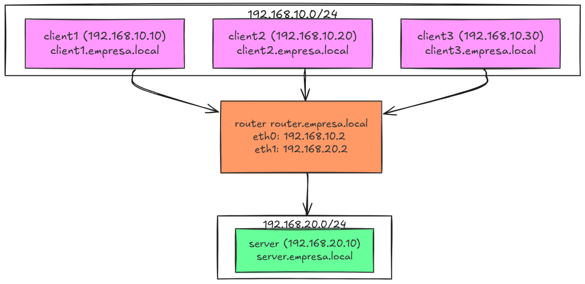

# 🛰️ Docker Network Simulator

Este projeto simula uma **infraestrutura de rede corporativa** utilizando **Docker Compose**, conectando múltiplos containers (clientes, roteador e servidor) em diferentes sub-redes.  
O objetivo é demonstrar como ocorre o roteamento, resolução de nomes via DNS e comunicação entre hosts em redes isoladas dentro de um ambiente virtualizado.

---

## 🧱 Estrutura da Rede

| Container | Função | Endereço IP | Rede | Domínio |
|------------|--------|--------------|-------|----------|
| router     | Roteador | 192.168.10.2 / 192.168.20.2 | client_network / server_network | router.empresa.local |
| server     | Servidor DNS (dnsmasq) | 192.168.20.10 | server_network | server.empresa.local |
| client1    | Cliente 1 | 192.168.10.10 | client_network | client1.empresa.local |
| client2    | Cliente 2 | 192.168.10.20 | client_network | client2.empresa.local |
| client3    | Cliente 3 | 192.168.10.30 | client_network | client3.empresa.local |

## 🧩 Topologia da Rede

Abaixo está a topologia do ambiente Docker que simula uma rede corporativa com clientes, servidor e roteador:



---

## ⚙️ Funcionalidades

✅ Simulação de duas redes locais (LANs);  
✅ Roteador central conectando ambas;  
✅ Servidor DNS interno (`dnsmasq`) com domínios locais (`empresa.local`);  
✅ Comunicação entre hosts por nome de domínio;  
✅ Configuração totalmente automatizada via Docker Compose.

---

## 🚀 Como executar

```bash
git clone https://github.com/seuusuario/Docker-Network-Simulator.git
cd Docker-Network-Simulator
docker compose up -d
````

## 🔍 Testes de conectividade

Entre em um container cliente e teste a comunicação:

````bash
docker exec -it client1 sh
ping router.empresa.local
ping server.empresa.local
````

## 🧰 Tecnologias utilizadas

- Docker & Docker Compose
- Alpine Linux
- Ubuntu
- dnsmasq
- Ferramentas de rede (ping, traceroute, iproute2, net-tools)

## 💬 Conclusão

Este projeto demonstra o funcionamento de redes isoladas, roteamento e DNS interno em um ambiente totalmente virtualizado via Docker.
É uma excelente base para estudos de redes, DevOps e infraestrutura, além de servir como exemplo de topologia corporativa simplificada.


#### 📘 Autor: Vitor Ferreira Gonçalves Silva
#### 📍 João Pessoa - PB
#### 🎓 Projeto acadêmico com foco em redes e containers Docker.
